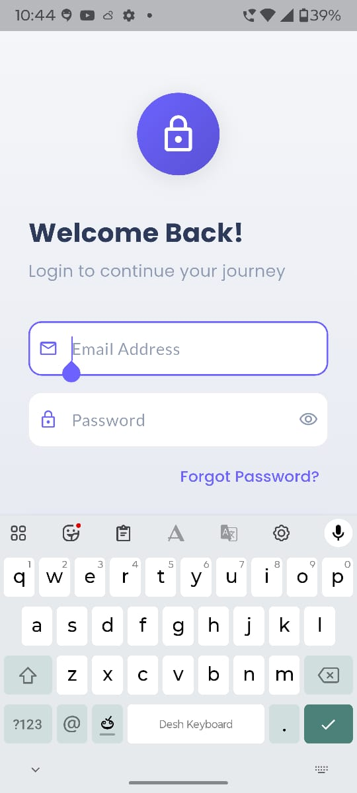
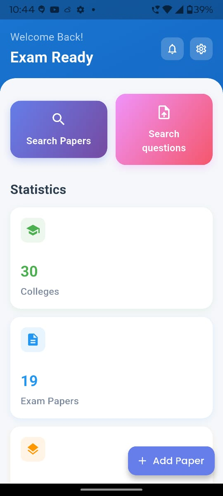

# Exam Ready 📚✨


A modern, feature-rich Flutter application designed to help users prepare for exams. This project leverages Firebase for backend services and Riverpod for state management, providing a seamless and reactive user experience.

---

## 📖 Table of Contents

- [About the Project](#about-the-project)
  - [Core Features](#core-features)
  - [Tech Stack](#tech-stack)
- [📸 Screenshots](#-screenshots)
- [🚀 Getting Started](#-getting-started)
  - [Prerequisites](#prerequisites)
  - [Installation](#installation)
- [💻 Usage](#-usage)
- [🏗️ Project Structure](#️-project-structure)
- [🧑‍💻 Development](#-development)
  - [Running Tests](#running-tests)
- [📦 Deployment](#-deployment)
- [🗺️ Roadmap](#️-roadmap)
- [🤝 Contributing](#-contributing)
- [📄 License](#-license)
- [📞 Contact](#-contact)
- [📝 Changelog](#-changelog)

---

## About the Project

**Exam Ready** is a comprehensive mobile application built with Flutter, designed to provide students with a robust platform for exam preparation. It features user authentication, question papers, and performance tracking, making studying efficient and engaging.

### Core Features

- **User Authentication:** Secure sign-up and sign-in with email/password and Google Sign-In.
- **Question Papers:** Browse and attempt various question papers.
- **Performance Tracking:** Users can track their scores and performance over time.
- **Cloud Storage:** Seamlessly sync user data and question papers using Firebase.
- **Engaging UI:** Smooth animations and a clean, modern user interface.

### Tech Stack

- **Frontend:** [Flutter](https://flutter.dev/)
- **Backend:** [Firebase](https://firebase.google.com/) (Authentication, Firestore, Storage)
- **State Management:** [Riverpod](https://riverpod.dev/), [Bloc](https://bloclibrary.dev/)
- **Image & Media:** [Cloudinary](https://cloudinary.com/), [Image Picker](https://pub.dev/packages/image_picker)
- **UI/Animations:** [Lottie](https://pub.dev/packages/lottie), [Flutter Animate](https://pub.dev/packages/flutter_animate)

---

## 📸 Screenshots

Here are some previews of the *Exam Ready* app:

| Login Screen                                    | Home Screen                                      |
| ----------------------------------------------- | ------------------------------------------------ |
|           |          |

---

## 🚀 Getting Started

Follow these instructions to get a copy of the project up and running on your local machine for development and testing purposes.

### Prerequisites

- [Flutter SDK](https://flutter.dev/docs/get-started/install) (version 3.9.2 or higher)
- [Firebase CLI](https://firebase.google.com/docs/cli#install_the_firebase_cli)
- An editor like [VS Code](https://code.visualstudio.com/) or [Android Studio](https://developer.android.com/studio)

### Installation

1.  **Clone the repository:**

    ```bash
    git clone https://github.com/{your-github-username}/{your-repo-name}.git
    cd {your-repo-name}
    ```

2.  **Set up Firebase:**

    - Create a new project on the [Firebase Console](https://console.firebase.google.com/).
    - Add an Android and/or iOS app to your Firebase project.
    - Follow the instructions to download the `google-services.json` file for Android and `GoogleService-Info.plist` for iOS.
    - Place `google-services.json` in the `android/app/` directory.
    - Place `GoogleService-Info.plist` in the `ios/Runner/` directory.

3.  **Create a `.env` file:**

    Create a `.env` file in the root of the project and add the necessary environment variables. See the `.env.example` section below.

4.  **Install dependencies:**

    ```bash
    flutter pub get
    ```

---

## 💻 Usage

To run the application, use the following command:

```bash
flutter run
```

This will launch the app on your connected device or simulator.

---

## 🏗️ Project Structure

```
exam_ready/
├── android/
├── assets/
│   ├── lottie/
│   └── images/
├── ios/
├── lib/
│   ├── config/
│   ├── data/
│   ├── models/
│   ├── providers/
│   ├── repositories/
│   ├── riverpod/
│   ├── screens/
│   ├── services/
│   ├── theme/
│   ├── utils/
│   ├── widgets/
│   └── main.dart
├── test/
└── pubspec.yaml
```

### Assets Management

All static assets (images, animations, etc.) are stored in the `assets/` directory:

- **`assets/lottie/`** - Lottie animation JSON files (login, signup, etc.)
- **`assets/images/`** - PNG, JPG, and other image files for the UI

To use an image in your code:

```dart
Image.asset('assets/images/logo.png')
```

All assets must be declared in `pubspec.yaml` under the `flutter.assets` section.

---

## 🧑‍💻 Development

This project uses `riverpod_generator` for code generation. When you create or modify providers, run the following command to generate the necessary files:

```bash
flutter pub run build_runner watch --delete-conflicting-outputs
```

### Running Tests

To run the test suite, use the following command:

```bash
flutter test
```

---

## 📦 Deployment

This project is set up for mobile app deployment on the Google Play Store and Apple App Store.

- **Android:** Follow the official Flutter documentation for [building and releasing an Android app](https://flutter.dev/docs/deployment/android).
- **iOS:** Follow the official Flutter documentation for [building and releasing an iOS app](https://flutter.dev/docs/deployment/ios).

---

## 🗺️ Roadmap

_(This section is a placeholder. Outline the future plans for the project here.)_

- [ ] Feature A
- [ ] Feature B
- [ ] Feature C

---

## 🤝 Contributing

Contributions are what make the open-source community such an amazing place to learn, inspire, and create. Any contributions you make are **greatly appreciated**.

Please see the `CONTRIBUTING.md` file for details on our code of conduct, and the process for submitting pull requests to us.

---

## 📄 License

This project is licensed under the MIT License - see the `LICENSE` file for details.

---

## 📞 Contact

_(This section is a placeholder. Add your contact information here.)_

Project Link: [https://github.com/{your-github-username}/{your-repo-name}](https://github.com/{your-github-username}/{your-repo-name})

---

## 📝 Changelog

All notable changes to this project will be documented in this file. See `CHANGELOG.md` for more information.
